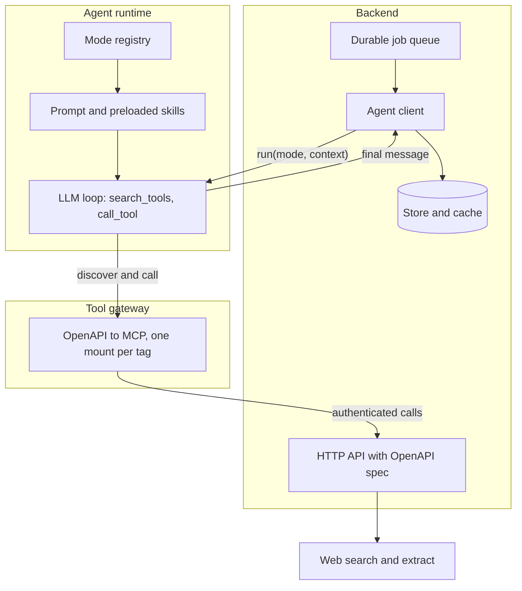
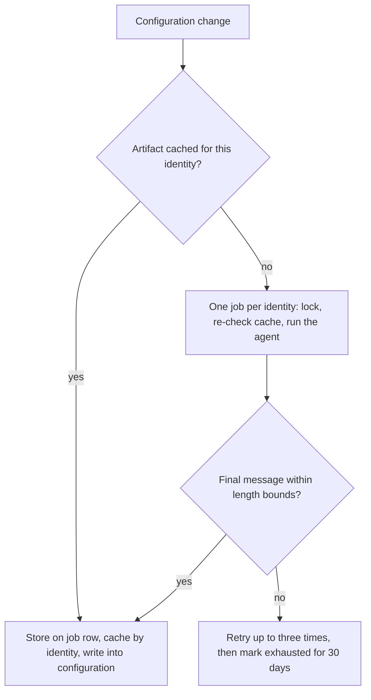

Most agent deployments I see are a chat box on top of a product. Ours started that way too. This is a write-up of the second step: using the same agent runtime as an internal service, called by a backend job, with no user in the loop, to produce an artifact that another model consumes. The domain does not matter for what follows. What matters is the shape of the system, what had to change to make an agent a reliable component rather than a demo, and what we learned about generated context as a first-class artifact. Deciding what a model gets to see now has a name, [context engineering](https://www.anthropic.com/engineering/effective-context-engineering-for-ai-agents); here the one doing the deciding is another agent.

**Key takeaways**

- An agent runtime becomes a service when three things are pinned: the tool set it may call, the shape of its output, and the contract for how the caller reads that output.
- Expose your own API to the agent through a generated tool gateway, not hand-written tools. The gateway is the catalog; the agent's job is to discover and call, never to know names.
- Generated context is a build artifact. Validate it, store it where humans can see it, key its cache on a normalized identity, and evaluate it with the consumer held constant.
- Most quality problems in the first runs were not prompt problems. They were wiring, caching and sampling problems that looked like prompt problems.
- Two rules for context written by one model for another: absence in a sample is not evidence, and never contradict a rule the consumer already enforces.
- Building this with an orchestrating agent and subagents worked. The failures were scope failures, and the human's job was scope.

## What does the ecosystem look like?

Four pieces, each already existing for other reasons, connected in a new way.



**The backend** owns the data, the HTTP API, the job queue and the store. It already documents every route with an [OpenAPI](https://spec.openapis.org/oas/v3.1.0.html) description. A route becomes an agent tool by carrying a tag and a small annotation block in the vocabulary of [MCP tool annotations](https://modelcontextprotocol.io/specification/2025-06-18/server/tools): read-only or not, idempotent or not. Nothing else is written for the agent.

**The tool gateway** reads that description at startup and exposes one [Model Context Protocol](https://modelcontextprotocol.io/specification/2025-06-18) (MCP) mount per tag. Generators for this step exist off the shelf; [FastMCP's OpenAPI integration](https://gofastmcp.com/integrations/openapi) is one. The mount the agent uses is the one meant for in-product assistance, scoped to a tenant by headers the gateway injects. The catalog is whatever the description says it is. That sounds obvious, and it caused our first bad run, more on that below.

**The agent runtime** is a [LangGraph](https://docs.langchain.com/oss/python/langgraph/overview) service with a registry of modes. A mode is a strategy object: which prompt form it renders, which skills are preloaded, which tools are granted, whether the mode is pinned for the whole thread or switchable, and how much output it may produce. Only two tools are bound to the model, `search_tools` and `call_tool`. Every domain tool goes through discovery first, which keeps the model from memorizing names and keeps the tool list out of the prompt.

**Skills** are Markdown files with frontmatter, in the shape the [Agent Skills specification](https://agentskills.io/specification) describes and Anthropic introduced with [Claude's skills](https://www.anthropic.com/engineering/equipping-agents-for-the-real-world-with-agent-skills), loaded on demand through a tool or preloaded by a mode. A skill is how-to knowledge. A mode decides which how-to is mandatory. This split turned out to be the most important convention in the runtime, and we got it wrong first.

## What changed to make the agent callable as a service?

The chat modes assume a person is present: they ask clarifying questions, format for a screen, end with an offer to continue. A headless mode has to remove all of that without forking the runtime.

**A pinned mode with strict grants.** The mode declares the four tools it may call and drops every other read-only tool from its catalog. Strict mode means "nothing except what is granted", including tools a chat user would expect. The caller sets the mode on the run request; the model cannot switch it.

**Context arrives as data, not prose.** The caller passes a typed context object with the run: the entity to research, its public website, optional known names. The runtime validates the shape and records it into the conversation as a server-owned message that skills and prompts can refer to. The prompt does not need to template it in.

**The output contract is the artifact.** The mode's skill says: your final message is the artifact and nothing else, plain paragraphs, no formatting, no narration before or between tool calls. The backend's client reads the final assistant message of the run. A length floor rejects refusals, apologies and "I could not find" answers; a ceiling rejects runaway output. Both count as failed attempts.

**The prompt got thinner with every review.** The first version was a dedicated system prompt of sixty lines holding the research protocol, the evidence rules, the output rules and a worked example. Reviewer round one: the method belongs in a skill that the mode preloads. Round two: the remaining prompt is duplicative, the shared base prompt already covers tool use and skill selection, and the skill can read the entity context from the recorded app context. The final shape is the shared base plus a two-sentence scope, with everything specific in the skill. The runtime already had this precedent; we just had not looked.

## How does the backend drive it?

The job side is ordinary distributed-systems hygiene, and all of it mattered.



- **One job per normalized identity**, not per tenant. The artifact is tenant-independent by design, so a cache keyed on the normalized identity is shared across tenants and the job is deduplicated across them.
- **Normalization at the boundary.** The identity is a URL. Three spellings of the same site had to collapse to one canonical form in the serializer, before anything hashed it, and the cache key is the registered domain as the [Public Suffix List](https://publicsuffix.org/) defines it. Every downstream key sees one value.
- **Lock, then re-check.** A domain lock with a fail-fast timeout prevents two executors from paying for the same research; a cache re-check under the lock turns the loser into a no-op.
- **Bounded retries with memory.** Three attempts, then the identity is marked as exhausted for thirty days so the next tenant does not retry immediately.
- **Time-bounded waits.** The flow that triggered the job waits for it with a bound and a time-scoped pending query. Without the time bound, a single dead-lettered job would block an identity forever. A final review caught that one.
- **Write the result where people can see it.** The first design resolved the artifact from an opaque cache at consumption time. Correct and invisible. The second stores it on the job row and writes it into the entity's configuration on completion, keeping the cache only as an accelerator that skips the job entirely. Editing the field makes it human-owned; clearing it means "regenerate".

## What did the first runs teach?

**Wiring failures look like prompt failures.** The first artifact was honest, well structured and wrong on the numbers. The logs showed the local agent connected to the deployed tool gateway, which had never heard of the new tool. The model spent fifteen discovery calls hunting for it, then proceeded without it. The startup line that reports the tool count was identical on both gateways, so the one number we treated as a signal was not one. Rule: before judging output quality, prove the tool catalog contains what the skill assumes.

**A cache you cannot inspect will serve a bad artifact forever.** A successful cache entry never retried, by design, and local development wrote into the shared environment's cache under a hashed row key. Evicting one entry meant computing the hash by hand. This is what moved the artifact into a queryable table. It is the configuration and data-dependency debt that [Sculley et al.](https://papers.nips.cc/paper_files/paper/2015/hash/86df7dcfd896fcaf2674f757a2463eba-Abstract.html) described for machine-learning systems, wearing a new coat.

**Absence becomes a directive.** When the sample did not contain a pattern, the agent wrote "do not assume that pattern exists". A consumer model reading that rule would argue against the pattern when it did appear. The fix was an evidence rule: when something is not observed in the reviewed sample, say so and stop; never turn absence into an instruction. And an explicit search pass for the things the agent had already concluded were absent, because it will not look for them otherwise.

**Generated context must not contradict the consumer's rules.** The consuming model enforces a hard rule about what evidence may establish a start date. The generated context told it to assume a start from the earliest record. Two instructions in opposite directions are worse than either alone. The fix was to constrain what the artifact may say on that axis and to have it name the markers the consumer already accepts, so the layers agree.

**Sample variance is a retrieval property.** Two runs on the same data returned different example sets. Once the wording was stable, the remaining coverage gap was in the retrieval tool's limits and pruning, not in the prompt.

## How do you evaluate generated context?

Hold the consumer constant and swap the context, one variable. We already had an evaluation suite for the consumer model with a human-written context inlined into the cases. The new arm overrides the context for exactly those cases. The subtlety is the judge: [LLM-as-a-judge](https://arxiv.org/abs/2306.05685) rubrics that render the context from the test case would grade the generated arm while reading the human one. The evaluation output now carries the context the model actually saw and the judge renders that. Judge blindness was already a documented lesson in that suite, and the literature on judges that [favour their own generations](https://arxiv.org/abs/2404.13076) says why it has to be the default; it still bit on the first attempt.

## How was it built, and what broke in the building?

The build was agentic too, in the orchestrator-and-workers shape Anthropic describes for its [research system](https://www.anthropic.com/engineering/multi-agent-research-system). One orchestrating session never edited code. It wrote the spec, split it into tasks, dispatched an implementer [subagent](https://code.claude.com/docs/en/sub-agents) per task, then a reviewer subagent with a package built from the working tree, ruled on findings, and kept a ledger of every ruling with the cost of being wrong, following the subagent-driven development skill in [Superpowers](https://github.com/obra/superpowers). A final whole-branch review on a stronger model found three real issues the task-level reviews had missed. Humans owned commits, migrations, deploys and billable evaluation runs.

Three house rules did more than any prompt: no comments in code so reviewers read the code, two or three tests per task, and no defensive wrappers on job paths because retry machinery already exists.

What broke was scope.

- **Unrequested hardening.** When a reviewer asked for a prompt restructure, the orchestrator reasoned that the shared prompt's formatting rules might produce extra messages and bundled a backend change to compensate. The human had already debugged the event stream and knew the existing selection worked. Reverted. The rule now: state a risk in one sentence, never implement a hedge, read the runtime path before proposing defensive code.
- **Over-engineering by default.** A separate service class for one method with two callers. Four tests where two carried the value. A helper duplicated across two files because each subagent only saw its own. Every correction was the same word, lean, and lean was also more correct each time.
- **Stray agents.** A skill that loads testing conventions spawned a background agent that went looking for untested classes and wrote suites for them, twice recreating a file a human had deliberately deleted. Subagents that invoke skills fan out further than intended. Any file you did not ask for is a defect.
- **Bot reviewers.** On one pull request, one bot flagged a "critical" signature clash between two functions, one of which did not exist, while another bot found two real bugs on the same diff. The severity label carried no information. The diff did.

## Limitations and what is next

The artifact is only as good as what the agent gets to read, and the retrieval tool's sampling is the current ceiling. The evaluation arm comparing human-written and agent-written context on identical cases is wired and not yet run at scale. If the generated arm is within a few points of the human one, the next investment is model selection for the writing agent, not prompt work. After that, coverage of the retrieval tool.

The general pattern, an agent runtime used as an internal worker against the system's own generated tool catalog, has held up. The parts that needed care were the boring ones: identity normalization, locks, bounded waits, visible storage, and a strict contract for what the agent's last message means.

## Technical report

A [technical report](https://doi.org/10.5281/zenodo.22698236) version of this post is published on Zenodo (DOI 10.5281/zenodo.22698236, CC BY 4.0). It adds a run-by-run comparison of the generated context against the human-written baseline, a related-work section placing the pattern next to retrieval, prompt optimization and multi-agent work, and a limitations section.

## References

1. Anthropic, [Effective context engineering for AI agents](https://www.anthropic.com/engineering/effective-context-engineering-for-ai-agents), 2025.
2. OpenAPI Initiative, [OpenAPI Specification v3.1.0](https://spec.openapis.org/oas/v3.1.0.html), 2021.
3. Model Context Protocol, [Specification 2025-06-18](https://modelcontextprotocol.io/specification/2025-06-18) and [Tools](https://modelcontextprotocol.io/specification/2025-06-18/server/tools) (discovery and annotations).
4. FastMCP, [OpenAPI integration](https://gofastmcp.com/integrations/openapi).
5. LangChain, [LangGraph overview](https://docs.langchain.com/oss/python/langgraph/overview).
6. Agent Skills, [Specification](https://agentskills.io/specification); Anthropic, [Equipping agents for the real world with Agent Skills](https://www.anthropic.com/engineering/equipping-agents-for-the-real-world-with-agent-skills), 2025.
7. Mozilla, [Public Suffix List](https://publicsuffix.org/).
8. Sculley et al., [Hidden Technical Debt in Machine Learning Systems](https://papers.nips.cc/paper_files/paper/2015/hash/86df7dcfd896fcaf2674f757a2463eba-Abstract.html), NeurIPS 2015.
9. Zheng et al., [Judging LLM-as-a-Judge with MT-Bench and Chatbot Arena](https://arxiv.org/abs/2306.05685), 2023.
10. Panickssery, Bowman, Feng, [LLM Evaluators Recognize and Favor Their Own Generations](https://arxiv.org/abs/2404.13076), 2024.
11. Anthropic, [How we built our multi-agent research system](https://www.anthropic.com/engineering/multi-agent-research-system), 2025.
12. Anthropic, [Claude Code subagents](https://code.claude.com/docs/en/sub-agents); Vincent, J., [Superpowers](https://github.com/obra/superpowers).

## Cite this article

Korkoshko, A. (2026, September 10). *Agents as internal services: running an LLM agent inside the system, against the system's own tools.* andrii.korkoshko.com. https://andrii.korkoshko.com/posts/agents-as-internal-services

Technical report: Korkoshko, A. (2026). *Agents as internal services: running an LLM agent inside the system, against the system's own tools* (Technical report, v1.0). Zenodo. https://doi.org/10.5281/zenodo.22698236

```bibtex
@misc{korkoshko2026agentsservices,
  author       = {Korkoshko, Andrii},
  title        = {Agents as internal services: running an {LLM} agent inside the system, against the system's own tools},
  year         = {2026},
  month        = sep,
  howpublished = {\url{https://andrii.korkoshko.com/posts/agents-as-internal-services}},
  note         = {Blog post}
}

@techreport{korkoshko2026agentsreport,
  author      = {Korkoshko, Andrii},
  title       = {Agents as internal services: running an {LLM} agent inside the system, against the system's own tools},
  year        = {2026},
  month       = sep,
  institution = {Zenodo},
  type        = {Technical report},
  number      = {v1.0},
  doi         = {10.5281/zenodo.22698236}
}
```
