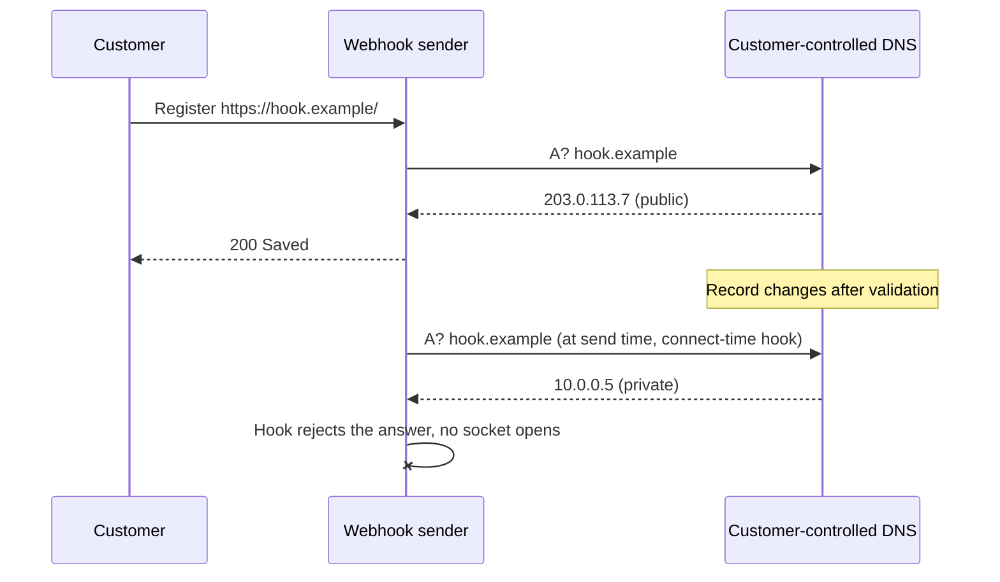

A SaaS backend lets customers register a webhook URL. When something happens, the server POSTs a signed JSON payload to that URL and stores the outcome, and the outcome, failure reason included, is shown back to the customer so they can debug their endpoint. A third-party security assessment flagged it as server-side request forgery, [CWE-918](https://cwe.mitre.org/data/definitions/918.html). The URL is fully customer-controlled, the request originates inside the private network, and nothing restricted where it could go. This is what it took to close it properly, including the parts I got wrong the first time.

**Key takeaways**

- Treat "customer-supplied URL" as "attacker-supplied URL" from day one.
- The error message is part of the attack surface. If it distinguishes outcomes, it is an oracle.
- Validate the URL, resolve it yourself, pin the answer at connect time, and check again at send time. Each layer closes a bypass of the previous one.
- Lenient URL parsers and IPv6 transition addresses are where the first version leaked.
- Count your tests.

## What made a plain "request to a URL" dangerous?

Two details turned a textbook SSRF into a practical one.

First, the response body never came back to the customer, so it looked harmless. But the failure text did: "HTTP 200", "HTTP 404", "connection refused", "timeout". That is a boolean oracle. Point the webhook at `https://10.0.0.5/` and read whether a host exists. Point it at a cloud metadata endpoint, `169.254.169.254` on [AWS](https://docs.aws.amazon.com/AWSEC2/latest/UserGuide/configuring-instance-metadata-service.html) or `metadata.google.internal` on [Google Cloud](https://cloud.google.com/compute/docs/metadata/overview), and read whether it answers.

Second, the shared HTTP client followed redirects. Even with a public-only allowlist, a customer could register a public URL whose server replies `302 Location: http://169.254.169.254/...`, and the client would follow it straight into the network. The [OWASP SSRF prevention cheat sheet](https://cheatsheetseries.owasp.org/cheatsheets/Server_Side_Request_Forgery_Prevention_Cheat_Sheet.html) lists both patterns; reading it before shipping would have saved a round.

## Which four layers closed it?

Doing only one of these is how you end up with a guard that passes the checklist and still leaks.

**1. Parse and validate the URL shape, with a strict parser.** Require `https` and the default port. Reject an empty host. Reject known-dangerous names outright: `localhost` and anything under `.localhost` ([RFC 6761](https://www.rfc-editor.org/rfc/rfc6761)), `.local` ([RFC 6762](https://www.rfc-editor.org/rfc/rfc6762)), `.internal` (reserved by ICANN for private use in [board resolution 2024.07.29.06](https://en.wikipedia.org/wiki/.internal)), and the cloud metadata hostname. Reject IP literals in the loopback, private ([RFC 1918](https://www.rfc-editor.org/rfc/rfc1918)), link-local ([RFC 3927](https://www.rfc-editor.org/rfc/rfc3927)), unspecified, multicast, carrier-grade NAT `100.64.0.0/10` ([RFC 6598](https://www.rfc-editor.org/rfc/rfc6598)), benchmarking `198.18.0.0/15` ([RFC 2544](https://www.rfc-editor.org/rfc/rfc2544)), `192.0.0.0/24` and reserved `240.0.0.0/4` ranges, all of which are catalogued in the [IANA IPv4 special-purpose registry](https://www.iana.org/assignments/iana-ipv4-special-registry/) defined by [RFC 6890](https://www.rfc-editor.org/rfc/rfc6890). Do the same for IPv6: `::1`, `::`, `fe80::/10` and multicast per [RFC 4291](https://www.rfc-editor.org/rfc/rfc4291), and unique-local `fc00::/7` per [RFC 4193](https://www.rfc-editor.org/rfc/rfc4193).

**2. Resolve the hostname yourself and reject if any answer is non-public.** A name that resolves to both a public and a private address is rejected, not partially allowed. Wildcard DNS services make this trivial to abuse otherwise: `10.0.0.1.nip.io` resolves to `10.0.0.1` through [nip.io](https://nip.io/) and looks like a normal domain.

**3. Disable redirects on the client that talks to customer URLs, and give it a DNS hook.** The webhook client is a separate client instance, not the shared one. Redirects are off at the HTTP-library layer and at the engine layer. The engine's DNS resolver is wrapped so every answer is re-checked against the same policy at connect time. This is the defence against [DNS rebinding](https://en.wikipedia.org/wiki/DNS_rebinding): a host that answers with a public IP during validation and a private IP two seconds later when the socket opens.

The sequence the DNS hook stops:



**4. Run the check at save time and again at send time.** Save-time validation gives the customer an immediate 400 with a clear reason. Send-time validation covers webhooks registered before the guard existed, and DNS that changed since registration.

## Why did the error message have to change too?

Independently of the layers above, the stored failure reason became a single static string, "Webhook delivery failed". Status codes, exception text and connection details go to server logs only. The policy rejections ("must use https", "must resolve to a public IP address") are still shown, because they describe the customer's own configuration, not the remote host. Without this change the four layers would still have left a smaller oracle in place.

## What went wrong the first time?

**A lenient URL parser is a security bug.** The first version used the HTTP framework's URL type. It accepted `https://exa mple.com/` and silently substituted `localhost` for a missing host, so `https:///path` parsed as a localhost URL. Switching to [`java.net.URI`](https://docs.oracle.com/en/java/javase/21/docs/api/java.base/java/net/URI.html), which rejects both, fixed it. If your parser is designed for convenience, it is the wrong parser at a security boundary.

**IPv4 hides inside IPv6.** `::ffff:10.0.0.1` (IPv4-mapped, [RFC 4291 §2.5.5.2](https://www.rfc-editor.org/rfc/rfc4291#section-2.5.5.2)), `64:ff9b::a00:1` (NAT64, [RFC 6052](https://www.rfc-editor.org/rfc/rfc6052)) and `2002:a00:1::` (6to4, [RFC 3056](https://www.rfc-editor.org/rfc/rfc3056)) all carry `10.0.0.1`. The first version checked the IPv6 bytes against IPv6 ranges only and let all three through. The fix extracts the embedded IPv4 address and runs the full IPv4 policy on it.

**The JDK's `isSiteLocalAddress` is not "is private".** [`InetAddress.isSiteLocalAddress()`](https://docs.oracle.com/en/java/javase/21/docs/api/java.base/java/net/InetAddress.html#isSiteLocalAddress()) covers RFC 1918 for IPv4 and the deprecated `fec0::/10` for IPv6, but not `fc00::/7` unique-local, not CGNAT, not the reserved ranges. You still need your own list.

**A DNS hook does nothing for IP literals.** [OkHttp](https://square.github.io/okhttp/) never calls its `Dns` interface for a literal address, so the engine-level guard cannot be the only guard. Literal blocking has to happen in the parse step.

**"Redirects off" may need two switches.** The framework had its own [redirect plugin](https://ktor.io/docs/client-redirect.html) installed unconditionally by the shared client factory, so turning off the engine's redirect handling alone would have left the framework re-issuing the request. The fix was a purpose-built client rather than an override.

**Kotlin test methods can silently vanish.** A test written as `fun x() = runBlocking { ... }` infers its return type from the lambda's last expression. End it with `assertNotNull(v)`, which returns `v`, and the method is no longer `void`. JUnit 5 [does not discover test methods that return a value](https://docs.junit.org/current/user-guide/#writing-tests-definitions), and it says nothing. One test was invisible until the reported count was compared with the number of `@Test` methods.

## How was it tested?

- Pure policy tests: a table of URLs per rejection reason, plus a table of IP literals for the address classifier, including the IPv6 transition forms.
- Resolver tests with an injected DNS function: public-only accepted, mixed rejected, empty and throwing rejected, and an assertion that policy rejections never trigger a lookup.
- HTTP client tests with a mock engine: a 302 with an internal `Location` is reported as a failure and the redirect target is never contacted; 500, 410 and transport errors all produce the same static message.
- One test through the real client: `https://localhost/` is refused by the DNS hook before any connection.
- Save-path tests: create and update with a private URL are rejected and never persisted; a rename-only update still re-checks the stored URL.

## What does the code look like?

Sanitized to the shape that matters. The policy is a pure function over a URI and a list of resolved addresses; the client is separate from the shared one and carries the DNS hook.

```kotlin
enum class Rejection(val message: String) {
    InvalidUrl("Webhook URL must be a valid absolute URL"),
    SchemeNotHttps("Webhook URL must use https"),
    NonDefaultPort("Webhook URL must use the default https port"),
    BlockedHost("Webhook URL host is not allowed"),
    UnresolvableHost("Webhook URL host could not be resolved"),
    NonPublicAddress("Webhook URL must resolve to a public IP address"),
}

fun parse(raw: String): Either<Rejection, URI> {
    val uri = runCatching { URI(raw.trim()) }.getOrNull() ?: return InvalidUrl.left()
    val host = uri.host.orEmpty().removeSurrounding("[", "]").trimEnd('.').lowercase()
    return when {
        !uri.scheme.equals("https", ignoreCase = true) -> SchemeNotHttps.left()
        uri.port != -1 && uri.port != 443 -> NonDefaultPort.left()
        host.isEmpty() -> InvalidUrl.left()
        isBlockedHostName(host) -> BlockedHost.left()
        literalOrNull(host)?.let { !isPublic(it) } == true -> NonPublicAddress.left()
        else -> uri.right()
    }
}

fun rejectionFor(addresses: Collection<InetAddress>): Rejection? = when {
    addresses.isEmpty() -> UnresolvableHost
    addresses.any { !isPublic(it) } -> NonPublicAddress
    else -> null
}

object PublicOnlyDns : Dns {
    override fun lookup(hostname: String): List<InetAddress> {
        val answers = Dns.SYSTEM.lookup(hostname)
        rejectionFor(answers)?.let { throw UnknownHostException(it.message) }
        return answers
    }
}
```

The client:

```kotlin
HttpClient(OkHttp) {
    expectSuccess = true
    followRedirects = false
    engine {
        config {
            followRedirects(false)
            followSslRedirects(false)
            dns(PublicOnlyDns)
        }
    }
}
```

## A test set you can reuse

Should be rejected: `https://127.0.0.1/`, `https://10.0.0.1/`, `https://169.254.169.254/`, `https://[::1]/`, `https://[::ffff:10.0.0.1]/`, `https://[64:ff9b::a00:1]/`, `https://10.0.0.1.nip.io/`, `https://localhost/`, `https://metadata.google.internal/`, `http://example.com/`, `https://example.com:8443/`, `https:///path`, `https://exa mple.com/`.

Should be accepted: a public HTTPS endpoint on port 443. Then confirm the failure text for a dead public host is the static message and nothing else.

## References

1. MITRE, [CWE-918: Server-Side Request Forgery (SSRF)](https://cwe.mitre.org/data/definitions/918.html).
2. OWASP, [Server-Side Request Forgery Prevention Cheat Sheet](https://cheatsheetseries.owasp.org/cheatsheets/Server_Side_Request_Forgery_Prevention_Cheat_Sheet.html) and [OWASP Top 10:2021 A10, SSRF](https://owasp.org/Top10/A10_2021-Server-Side_Request_Forgery_%28SSRF%29/).
3. Rekhter et al., [RFC 1918: Address Allocation for Private Internets](https://www.rfc-editor.org/rfc/rfc1918), 1996.
4. Cheshire, Aboba, Guttman, [RFC 3927: Dynamic Configuration of IPv4 Link-Local Addresses](https://www.rfc-editor.org/rfc/rfc3927), 2005.
5. Weil et al., [RFC 6598: IANA-Reserved IPv4 Prefix for Shared Address Space](https://www.rfc-editor.org/rfc/rfc6598), 2012.
6. Bradner, McQuaid, [RFC 2544: Benchmarking Methodology for Network Interconnect Devices](https://www.rfc-editor.org/rfc/rfc2544), 1999.
7. Cotton et al., [RFC 6890: Special-Purpose IP Address Registries](https://www.rfc-editor.org/rfc/rfc6890), 2013, and the live [IANA IPv4](https://www.iana.org/assignments/iana-ipv4-special-registry/) and [IPv6](https://www.iana.org/assignments/iana-ipv6-special-registry/) special-purpose registries.
8. Hinden, Deering, [RFC 4291: IP Version 6 Addressing Architecture](https://www.rfc-editor.org/rfc/rfc4291), 2006.
9. Hinden, Haberman, [RFC 4193: Unique Local IPv6 Unicast Addresses](https://www.rfc-editor.org/rfc/rfc4193), 2005.
10. Bao et al., [RFC 6052: IPv6 Addressing of IPv4/IPv6 Translators](https://www.rfc-editor.org/rfc/rfc6052), 2010.
11. Carpenter, Moore, [RFC 3056: Connection of IPv6 Domains via IPv4 Clouds](https://www.rfc-editor.org/rfc/rfc3056), 2001.
12. Cheshire, Krochmal, [RFC 6761: Special-Use Domain Names](https://www.rfc-editor.org/rfc/rfc6761), 2013, and [RFC 6762: Multicast DNS](https://www.rfc-editor.org/rfc/rfc6762), 2013.
13. ICANN Board, resolution 2024.07.29.06 reserving `.internal` for private use, 29 July 2024; summarised on [Wikipedia](https://en.wikipedia.org/wiki/.internal) with the IANA [proposal notice](https://www.iana.org/news/2024/proposed-private-use-tld).
14. AWS, [Instance metadata service](https://docs.aws.amazon.com/AWSEC2/latest/UserGuide/configuring-instance-metadata-service.html); Google Cloud, [VM metadata overview](https://cloud.google.com/compute/docs/metadata/overview).
15. Oracle, [`java.net.URI`](https://docs.oracle.com/en/java/javase/21/docs/api/java.base/java/net/URI.html) and [`InetAddress.isSiteLocalAddress()`](https://docs.oracle.com/en/java/javase/21/docs/api/java.base/java/net/InetAddress.html#isSiteLocalAddress()), Java 21 API.
16. Square, [OkHttp](https://square.github.io/okhttp/); JetBrains, [Ktor client redirects](https://ktor.io/docs/client-redirect.html).
17. JUnit team, [JUnit 5 User Guide, test classes and methods](https://docs.junit.org/current/user-guide/#writing-tests-definitions).
18. [nip.io](https://nip.io/) wildcard DNS; [DNS rebinding](https://en.wikipedia.org/wiki/DNS_rebinding).

## Cite this article

Korkoshko, A. (2026, September 10). *Your webhook feature is an SSRF feature until proven otherwise.* andrii.korkoshko.com. https://andrii.korkoshko.com/posts/your-webhook-feature-is-an-ssrf-feature

```bibtex
@misc{korkoshko2026webhookssrf,
  author       = {Korkoshko, Andrii},
  title        = {Your webhook feature is an {SSRF} feature until proven otherwise},
  year         = {2026},
  month        = sep,
  howpublished = {\url{https://andrii.korkoshko.com/posts/your-webhook-feature-is-an-ssrf-feature}},
  note         = {Blog post}
}
```
