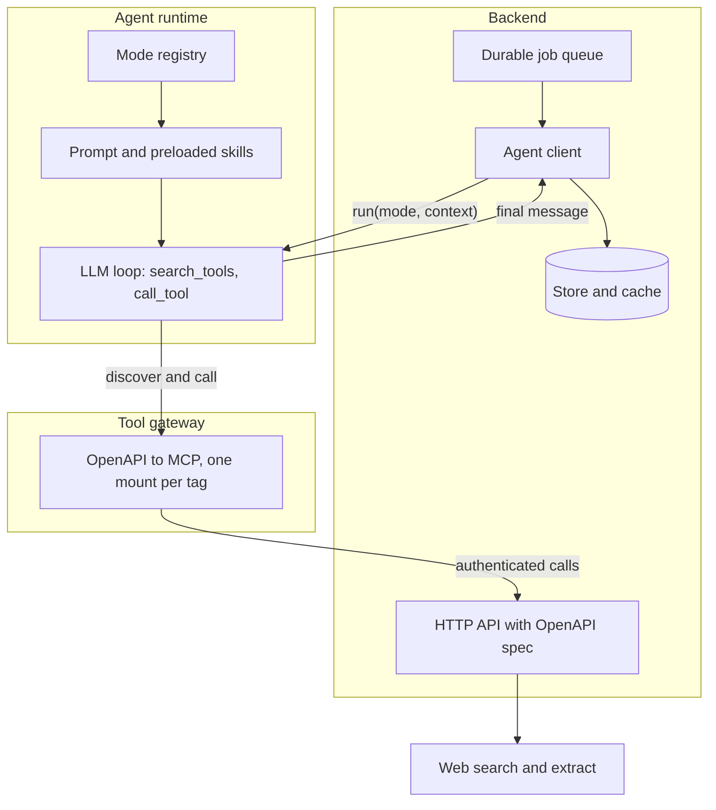
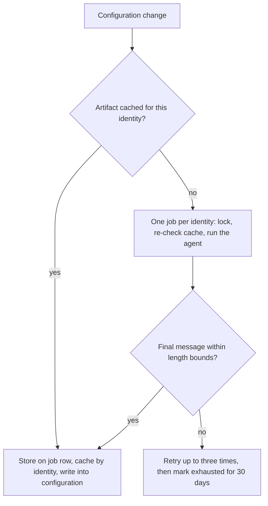

# 1. Introduction

Most agent deployments are a chat box on top of a product: a person types, the model calls a few tools, the person reads the answer. The system described here started that way too. This report is about the second step, using the same agent runtime as an internal service, called by a backend job with no user in the loop, to produce an artifact that another model consumes.

The domain is deliberately left out. The consumer is a model that infers structured facts about an entity from raw records; the artifact is a few dense paragraphs describing how that entity behaves, written for a model rather than a person. A colleague had written one such artifact by hand in about an hour, with a coding agent, the backend's internal tools and web search, and the consumer's metrics for that entity moved sharply. That does not scale to thousands of entities. The question was whether an agent could reproduce that writing act headlessly, for any entity, with evidence, and what it takes to make an agent a reliable component rather than a demo.

The report makes five claims, each grounded in the system as built:

1. An agent runtime becomes a service when three things are pinned: the tool set it may call, the shape of its output, and the contract for how the caller reads that output (Section 3.2).
2. The agent should reach the system's own API through a tool gateway generated from the API description, not through hand-written tools; the gateway is the catalog, and the agent discovers and calls rather than knowing names (Section 3.1).
3. Generated context is a build artifact: validated, stored where humans can see and edit it, cached by a normalized identity, and evaluated with the consumer held constant (Sections 3.3 and 5).
4. The first quality problems were wiring, caching and sampling problems that looked like prompt problems (Section 4).
5. Context written by one model for another needs two rules that prompts for human readers do not: absence in a sample is not evidence, and the artifact must not contradict a rule the consumer already enforces (Section 4).

Section 6 describes how the system was built, by an orchestrating agent dispatching implementer and reviewer subagents, and what broke on that side. Section 7 relates the pattern to prior work, Section 8 states limitations, and Section 9 concludes.

# 2. Background

**The runtime.** The agent runtime is a LangGraph service [5] with a registry of *modes*. A mode is a strategy object: which prompt form it renders, which skills are preloaded, which tools are granted, whether the mode is pinned for the whole thread or switchable, and how much output it may produce. Only two tools are bound to the model, `search_tools` and `call_tool`; every domain tool goes through discovery first, which keeps the model from memorizing tool names and keeps the tool list out of the prompt. *Skills* are Markdown files with front matter in the shape of the Agent Skills specification [6], loaded on demand through a tool or preloaded by a mode. A skill is how-to knowledge; a mode decides which how-to is mandatory.

**The tool gateway.** The backend documents every HTTP route with an OpenAPI description [2]. A gateway reads that description at startup and exposes one Model Context Protocol (MCP) [3] mount per tag, scoped to a tenant by headers the gateway injects. A route becomes an agent tool by carrying a tag and a small annotation block in the vocabulary of MCP tool annotations, read-only or not, idempotent or not. Nothing else is written for the agent.

**The consumer.** A second model reads raw records for one entity and infers a handful of structured facts. It is only as good as what it knows about how that entity behaves, and that knowledge arrives as a text context alongside the records. The manual context that motivated this work was about five thousand characters of plain prose with no headings: conditional rules ("a step above the usual escalation with no new one-time line means a renegotiation; reset the clock") rather than a report. A template with fields would lose exactly the part that helped.

**Terminology.** The *artifact* is the generated context. The *identity* is the normalized public URL of the entity, the key under which artifacts are cached. The *consumer* is the downstream model.

# 3. System design

## 3.1 The ecosystem

Four pieces, each already existing for other reasons, are connected in a new way (Figure 1).

*Figure 1. The backend calls the agent runtime with a mode and a typed context; the agent discovers and calls the backend's own API through the generated gateway; the final message returns to the backend and is stored.*

The backend owns the data, the HTTP API, the job queue and the store. The gateway is the catalog: whatever the OpenAPI description says exists, exists for the agent, and nothing else does. Generators for this step exist off the shelf [4]; the choices that mattered were tag-scoped mounts, annotations carried on the routes themselves, and binding only the two discovery tools to the model. One tool was added for this work: the existing surface could search records for one tenant, and the artifact needs the opposite, every tenant's records for one entity, grouped and in chronological order, capped at a token budget. Without it the agent has only the web, and the web does not contain year-over-year record sequences.

## 3.2 Making the agent callable as a service

The chat modes assume a person is present: they ask clarifying questions, format for a screen, and end with an offer to continue. A headless mode has to remove all of that without forking the runtime.

**A pinned mode with strict grants.** The mode declares the four tools it may call (record search, line items, web search, web extract) and drops every other tool from its catalog, including read-only tools a chat user would expect. The caller sets the mode on the run request; the model cannot switch it.

**Context arrives as data, not prose.** The caller passes a typed context object with the run: the entity, its public website, optional known names. The runtime validates the shape and records it into the conversation as a server-owned message that skills and prompts can refer to. The prompt does not template it in.

**The output contract is the artifact.** The mode's skill states that the final message is the artifact and nothing else: plain paragraphs, no formatting, no narration before or between tool calls. The backend's client reads the final assistant message of the run. A length floor rejects refusals, apologies and "I could not find" answers; a ceiling rejects runaway output. Both count as failed attempts.

**The prompt got thinner with every review.** The first version was a dedicated system prompt of about sixty lines holding the research protocol, the evidence rules, the output rules and a worked example. The first review moved the method into a skill that the mode preloads. The second found the remaining prompt duplicative: the shared base prompt already covers tool use and skill selection, and the skill can read the entity context from the recorded message. The final shape is the shared base plus a two-sentence scope, with everything specific in the skill. The runtime already had this precedent; nobody had looked.

## 3.3 Job orchestration

The job side is ordinary distributed-systems hygiene, and all of it mattered (Figure 2).

*Figure 2. The job path from a configuration change to a stored, visible artifact.*

- **One job per normalized identity, not per tenant.** The artifact is tenant-independent by design, so a cache keyed on the identity is shared across tenants and the job is deduplicated across them.
- **Normalization at the boundary.** The identity is a URL. Three spellings of the same site (`www.example.com/`, `example.com`, `https://example.com`) collapse to one canonical form in the serializer, before anything hashes it, and the cache key is the registered domain as the Public Suffix List [7] defines it. Every downstream key sees one value.
- **Lock, then re-check.** A per-identity lock with a fail-fast timeout prevents two executors from paying for the same research; a cache re-check under the lock turns the loser into a no-op.
- **Bounded retries with memory.** Three attempts, then the identity is marked exhausted for thirty days so the next tenant does not retry immediately.
- **Time-bounded waits.** The flow that triggered the job waits for it with a bound and a time-scoped pending-job query. Without the time bound, a single dead-lettered job would block an identity forever; the final review (Section 6) caught that one.
- **Write the result where people can see it.** The first design resolved the artifact from an opaque cache at consumption time. It was correct and invisible: not in the entity's settings, not in a table anyone could query, and evicting one entry meant computing a hash by hand. The second design stores the artifact on the job row and writes it into the entity's configuration on completion, keeping the cross-tenant cache only as an accelerator that skips the job. Editing the field makes the artifact human-owned; clearing it means "regenerate".

# 4. Observations from the first runs

Three runs were made for one entity for which a human-written artifact existed, so that the generated artifact could be compared with a baseline. The baseline had been written from a larger sample than the agent's retrieval tool returns. Table 1 summarizes the comparison on domain-neutral axes: whether the agent could reach the record-search tool, how many of the two numeric parameters in the artifact fell within the baseline's stated range, how many rules the agent derived from records that the baseline did not contain, whether the artifact turned an absence in its sample into a directive, and how many distribution patterns it found (the baseline, from its larger sample, listed four).

| Run | Record tool reachable | Numeric parameters within baseline range (of 2) | Record-derived rules beyond the baseline | Absence stated as a directive | Distribution patterns found (baseline: 4) |
|---|---|---|---|---|---|
| 1 | No: the agent was connected to a gateway that did not expose the tool | 0 | 0 | Not applicable, no records read | 0 |
| 2 | Yes | 2 | 2 | Yes | 1 |
| 3 | Yes, plus an explicit search pass for channels | 2 | 2 | No | 3 |

*Table 1. Three runs against the human-written baseline for one entity.*

**Wiring failures look like prompt failures.** The first artifact was honest, well structured, and wrong on both numeric parameters; it also opened by stating that no records were held for the entity. The logs explained it: the local agent was still connected to the deployed tool gateway, which had never heard of the new record tool. The model spent about fifteen discovery calls and forty thousand prompt tokens looking for a tool that was not in the catalog, then wrote a web-only artifact. The startup line reporting the tool count was identical for the deployed and local gateways, so the one number that had been treated as a signal was not one. Rule: before judging output quality, prove that the tool catalog contains what the skill assumes; the failure mode "tool absent" is indistinguishable from "model did not try".

**A cache that cannot be inspected will serve a bad artifact forever.** A successful cache entry was never retried, by design, and local development wrote into the shared environment's cache under a hashed row key. The weak first artifact would have been served indefinitely. That, more than any design argument, moved the artifact into a queryable table. It is the configuration and data-dependency debt described by Sculley et al. [8] for machine-learning systems, in a new form.

**Absence became a directive.** In run 2 the sample did not contain one distribution channel, and the artifact wrote "do not assume that channel is present". The baseline, written from a larger sample, listed four such channels. A consumer reading the generated rule would argue against a channel record sitting in front of it. The fix was an evidence rule in the skill: when a pattern does not appear in the reviewed sample, say that it was not observed and stop; never turn absence into an instruction. It was paired with an explicit search pass for the channel types, because an agent will not go looking for what it has already concluded is absent. In run 3 the pass found three of the four.

**Generated context must not contradict the consumer's rules.** The consumer enforces a hard rule about which evidence may establish a start date: a single dated record never does; it needs one of a small set of markers. The run-2 artifact said "assume a fixed term from the earliest dated record". Two instructions pulling in opposite directions are worse than either alone. The fix constrained what the artifact may say on that axis to a default term length and had it name the start markers the consumer already accepts, so the two layers agree.

**Sample variance is a retrieval property.** Runs 2 and 3 on the same data returned different example sets from the record tool. Once the wording was stable, the remaining coverage gap was in the retrieval tool's limits and pruning, not in the prompt.

**Evidence over recall paid off.** With records in hand, the run-2 artifact matched the baseline on both numeric parameters and added two rules the baseline did not contain, both derived from record sequences: a record's own stated end date can cover only the first year while labelled annual records continue, and a label on a line item lost to a multi-year window on the same record.

# 5. Evaluating generated context

Comparing artifacts means holding the consumer constant and swapping the context, one variable. An evaluation suite for the consumer already existed, with a human-written context inlined into the cases for the entity in question. The new arm overrides the context for exactly those cases with the generated artifact.

The subtlety is the judge. The suite's rubric rendered the context from the test case, so a judge grading the generated arm would have been reading the human-written context. The evaluation output now carries the context the consumer actually saw, and the rubric renders that. LLM-as-a-judge evaluation [9] is known to carry biases, including a preference for a judge's own generations [10], so a judge that cannot tell which arm it is grading is the baseline rather than a refinement. Judge blindness was already a documented lesson in that suite; it still bit on the first attempt.

The arm is wired and had not been run at scale at the time of writing (Section 8). The decision rule is stated in advance: if the generated arm is within a few points of the human arm on the primary accuracy metric and does not regress abstention, the next investment is model selection for the writing agent, not prompt work.

# 6. Building the system with agents

The system was built by an orchestrating agent in the orchestrator-and-workers shape described by Anthropic for its research system [11]. The orchestrating session never edited code. It wrote the specification, split it into tasks, and for each task dispatched an implementer subagent [12] with a brief, then a reviewer subagent with a review package built from the working tree, ruled on each finding, and dispatched a fix round, following the subagent-driven development skill of the Superpowers framework [13]. Every ruling went into a ledger file with the cost of being wrong stated next to it. A final whole-branch review on a stronger model than the implementers found three real issues the task-level reviews had missed: the unbounded pending-job query of Section 3.3, an enqueue call placed inside a cadence check so that inference-only configurations never refreshed, and a background pre-call feeding tenant-specific text into a globally cached artifact. Humans owned commits, migrations, deploys and the billable evaluation runs.

Three house rules shaped the output more than any prompt: no comments in code, including SQL and configuration, so that reviewers read the code; two or three tests per task, with extra tests deleted by the human; and no defensive wrappers on the job path, because exceptions propagate to retry machinery that already exists.

What broke was scope.

- **Unrequested hardening.** When a reviewer asked for a prompt restructure, the orchestrator reasoned that the shared base prompt's formatting rules might make the model emit extra messages and bundled a backend change to take the longest message rather than the final one. The human had already debugged the event stream and knew final-message selection worked. It was reverted. The rule that followed: if a risk seems real, state it in one sentence and stop; never implement a hedge; read the runtime path before proposing defensive code.
- **Over-engineering by default.** A separate service class for one method with two callers. Four tests where two carried the value. A helper duplicated across two files because each subagent saw only its own. Every correction was the same word, lean, and the lean version was also the more correct one each time.
- **Stray agents.** A skill that loads testing conventions spawned a background agent that went looking for untested classes and wrote suites for them, twice recreating a file a human had deliberately deleted. Subagents that invoke skills fan out further than intended. Any file that was not asked for is a defect.
- **Automated reviewers.** On one pull request a bot flagged a "critical" JVM signature clash between two extension functions, one of which did not exist. On the same pull request another bot found two real bugs: a refresh branch that ran while the artifact job was still pending, and a null check where every other path used blank-or-null. The severity label carried no information; the diff did.

# 7. Related work

**Agent architectures.** Anthropic distinguishes workflows, where code orchestrates model calls, from agents, where the model directs its own tool use [14]; the runtime here is an agent in that sense, but the service boundary around it is a workflow: a job, a pinned mode, a validated output. ReAct [15] and Toolformer [16] established the interleaved reason-and-call loop that `search_tools` and `call_tool` implement. Multi-agent frameworks such as AutoGen [17] and orchestrator-worker systems [11] compose several agents at run time; in this work the multi-agent part was the development process (Section 6), not the runtime, which is a single agent invoked as a service.

**Tool exposure.** MCP [3] standardizes tool discovery and invocation and defines the annotations (read-only, idempotent) used here. Generating an MCP server from an OpenAPI description is supported by existing tooling [4]. This work adds three conventions on top: one mount per OpenAPI tag, annotations carried on the routes so the gateway needs no hand-written tool code, and binding only discovery tools to the model so that the tool list never enters the prompt.

**Context.** Retrieval-augmented generation [18] fetches passages at query time; the artifact here is generated offline, stored, and supplied whole. Work on how models use long contexts [19] motivates the artifact's form: a few dense paragraphs of rules rather than a report. Automatic prompt engineering and optimization, APE [20], OPRO [21] and DSPy [22], search over prompt text against a metric with the task fixed; here the consumer's prompt is fixed and the generated document is domain knowledge, evaluated by swapping it against a human-written one with the consumer held constant. Surveys of hallucination [23] focus on content unsupported by the input; the "absence becomes a directive" failure of Section 4 is the inverse, a confident generalization over-supported by a thin input, and needs its own rule.

**Evaluation.** LLM-as-a-judge [9] and its self-preference bias [10] are the reasons the evaluation design of Section 5 renders the context the consumer actually saw and keeps the judge blind to the arm.

**Systems debt.** Sculley et al. [8] catalogued configuration debt and undeclared data dependencies in machine-learning systems. The decision to store the artifact on a job row and in the entity's configuration, rather than only in a hashed cache, is a direct response to that catalogue.

**Skills and subagents.** The skill format follows the Agent Skills specification [6], and the development process used Claude Code subagents [12] through the Superpowers skill set [13].

# 8. Limitations

- The runs in Section 4 cover one entity, chosen because a human-written baseline existed for it. The comparison is qualitative (within a stated range, rule present or absent) and has no statistical weight. The planned evaluation arm (Section 5) is the quantitative test and had not been run at scale at the time of writing.
- The system is proprietary; no code or data accompanies this report. The claims are about a system shape, and the report gives enough of that shape for another team to reproduce it against their own API and runtime, but not the artifact itself.
- The baseline was written from a larger sample than the agent's retrieval tool returns; some of the gap in Table 1 (three channels found against four listed) is attributable to retrieval limits rather than to the agent.
- The development-process observations in Section 6 come from one codebase and one orchestrating session; they are reported as observations, not as a method with measured outcomes.

# 9. Conclusion

An agent runtime built for chat can be used as an internal service against the system's own generated tool catalog. The parts that needed care were the boring ones: identity normalization at the boundary, a lock with a re-check, bounded retries with memory, time-bounded waits, storage a person can read and edit, and a strict contract for what the agent's final message means. When the output was weak, the causes were in the wiring, the cache and the sample before they were in the prompt, and the way to find that out was to verify the tool catalog before judging the text. Context written by one model for another needs two rules of its own: absence in a sample is not evidence, and the artifact must not contradict a rule the consumer already enforces. Building the system with an orchestrating agent and subagents worked, and the failures on that side were failures of scope, which remained the human's job.

# References

1. Anthropic. Effective context engineering for AI agents. 2025. https://www.anthropic.com/engineering/effective-context-engineering-for-ai-agents
2. OpenAPI Initiative. OpenAPI Specification v3.1.0. 2021. https://spec.openapis.org/oas/v3.1.0.html
3. Model Context Protocol. Specification, revision 2025-06-18, and the Tools section (discovery and annotations). https://modelcontextprotocol.io/specification/2025-06-18 and https://modelcontextprotocol.io/specification/2025-06-18/server/tools
4. FastMCP. OpenAPI integration. https://gofastmcp.com/integrations/openapi
5. LangChain. LangGraph overview. https://docs.langchain.com/oss/python/langgraph/overview
6. Agent Skills specification, https://agentskills.io/specification; Anthropic. Equipping agents for the real world with Agent Skills. 2025. https://www.anthropic.com/engineering/equipping-agents-for-the-real-world-with-agent-skills
7. Mozilla. Public Suffix List. https://publicsuffix.org/
8. D. Sculley et al. Hidden Technical Debt in Machine Learning Systems. NeurIPS 2015. https://papers.nips.cc/paper_files/paper/2015/hash/86df7dcfd896fcaf2674f757a2463eba-Abstract.html
9. L. Zheng et al. Judging LLM-as-a-Judge with MT-Bench and Chatbot Arena. 2023. https://arxiv.org/abs/2306.05685
10. A. Panickssery, S. R. Bowman, S. Feng. LLM Evaluators Recognize and Favor Their Own Generations. 2024. https://arxiv.org/abs/2404.13076
11. Anthropic. How we built our multi-agent research system. 2025. https://www.anthropic.com/engineering/multi-agent-research-system
12. Anthropic. Claude Code: create custom subagents. https://code.claude.com/docs/en/sub-agents
13. J. Vincent. Superpowers: an agentic skills framework and software development methodology. https://github.com/obra/superpowers
14. Anthropic. Building effective agents. 2024. https://www.anthropic.com/engineering/building-effective-agents
15. S. Yao et al. ReAct: Synergizing Reasoning and Acting in Language Models. 2022. https://arxiv.org/abs/2210.03629
16. T. Schick et al. Toolformer: Language Models Can Teach Themselves to Use Tools. 2023. https://arxiv.org/abs/2302.04761
17. Q. Wu et al. AutoGen: Enabling Next-Gen LLM Applications via Multi-Agent Conversation. 2023. https://arxiv.org/abs/2308.08155
18. P. Lewis et al. Retrieval-Augmented Generation for Knowledge-Intensive NLP Tasks. 2020. https://arxiv.org/abs/2005.11401
19. N. F. Liu et al. Lost in the Middle: How Language Models Use Long Contexts. 2023. https://arxiv.org/abs/2307.03172
20. Y. Zhou et al. Large Language Models Are Human-Level Prompt Engineers. 2022. https://arxiv.org/abs/2211.01910
21. C. Yang et al. Large Language Models as Optimizers. 2023. https://arxiv.org/abs/2309.03409
22. O. Khattab et al. DSPy: Compiling Declarative Language Model Calls into Self-Improving Pipelines. 2023. https://arxiv.org/abs/2310.03714
23. L. Huang et al. A Survey on Hallucination in Large Language Models: Principles, Taxonomy, Challenges, and Open Questions. 2023. https://arxiv.org/abs/2311.05232
